# Creating and Querying the Graph Model (Course - Provider)

### CREATE:


```
CREATE (p :Provider);
```


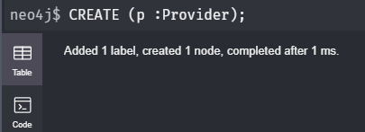

* A node with a label Provider is created.


```
CREATE (p :Provider {name: 'one.com', location: 'USA'})
return p;
```


&nbsp;&nbsp;&nbsp;&nbsp;&nbsp;&nbsp;&nbsp;    

* A node with a label Provider  and properties with name and location in key value pair is created. 


```
Create (c :Course {code: 'udm004', title:'Neo4j', tags: ['nosql', 'neo4j', 'database'] , price: 37})
Return c;
```


&nbsp;&nbsp;&nbsp;&nbsp;&nbsp;&nbsp;&nbsp;    

* A node with a label Course  and properties with code,price,tags and title in key value pair is created.


### MATCH:


```
match (p :Provider {name: 'one.com', location: 'USA'})
return p;
```


&nbsp;&nbsp;&nbsp;&nbsp;&nbsp;&nbsp;&nbsp;    

* A node with the given properties is matched in the same pattern and returned.


```
match (p :Provider {name: 'one.com', location: 'USA'})
```


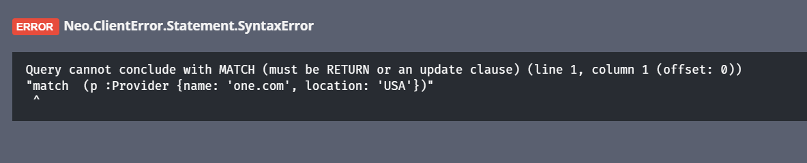

* Using match command alone produces an error.


### RETURN:


```
match (p:Provider),(c:Course)
return p,c;
```


&nbsp;&nbsp;&nbsp;&nbsp;&nbsp;&nbsp;&nbsp;    

* Nodes with different labels are matched and returned.


### CREATE RELATIONSHIP:


```
match (p :Provider {name: 'one.com', location: 'USA'}),(c :Course {code: 'udm004', title:'Neo4j', tags: ['nosql', 'neo4j', 'database'] , price: 37})
create (p)-[pb:PUBLISHED {year:2015}]->(c)
return p,pb,c;
```


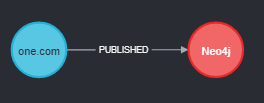&nbsp;&nbsp;&nbsp;&nbsp;&nbsp;&nbsp;&nbsp;    

* A relationship between two nodes with a year property is created.


### SET:


```
match (p:Provider {name:’one.com', location: 'USA'}) set p.location='India'
return p;
```


&nbsp;&nbsp;&nbsp;&nbsp;&nbsp;&nbsp;&nbsp;    

* The location property of a node is updated from USA to India.


### WHERE:


```
match (n :Provider) 
where n.location='India'
return n;
```


&nbsp;&nbsp;&nbsp;&nbsp;&nbsp;&nbsp;&nbsp;    

* The node with the location specified in where condition is displayed.


### REMOVE:


```
match (p :Provider {name: 'one.com'})
remove p.location
return p;

```


&nbsp;&nbsp;&nbsp;&nbsp;&nbsp;&nbsp;&nbsp;    

* A key and its corresponding value is removed.


### DELETE:

To delete, first create the node:


```
Create (c:course{name:'gcp'})return c;
```


 

* The node is created.


```
match (c:course{name:'gcp'}) delete c;
```


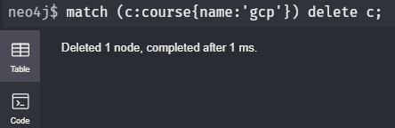 

* The node is deleted.


### MERGE:


```
MERGE (n:Course {title:'GCP'}) 
ON CREATE SET n.nickname=['gcp_create','google_create'] 
ON MATCH SET n.nickname=['gcp_match','google_match']
RETURN n;
```


&nbsp;&nbsp;&nbsp;&nbsp;&nbsp;&nbsp;&nbsp;    

* The student node with name Thomas does not exist and hence it is created with the nickname indicated in ON CREATE command.

**Executing the same query again:**


&nbsp;&nbsp;&nbsp;&nbsp;&nbsp;&nbsp;&nbsp;    

* The student node with name Thomas already exist and hence the nickname is changed to the one indicated in ON MATCH command.


## Before proceeding further:


To clear the entire database:

1) First the relationship between the nodes must be deleted.
```
MATCH ()-[r]-() DELETE r;
```
2) Then the nodes must be cleared.
```
MATCH (n) DELETE n;
```


## Aggregation Commands:

*Note:Execute the below query to obtain the same output as displayed.*
```
//Course
CREATE
            (c1 :Course {code: 'udm001', title:'Essential Java for Beginners', tags: ['java', 'programming language'], price: 43}),
            (c2 :Course {code: 'udm004', title:'Neo4j', tags: ['nosql', 'neo4j', 'database'] , price: 37}),
            (c3:Course {code: 'udm005', title:'Spring Framework', tags: ['spring', 'java'], price: 37}),
            (c4:Course {code: 'den001', title:'Neo4j', tags: ['nosql', 'neo4j', 'database'] , price: 27}),
            (c5:Course {code: 'den003',title:'Spring Framework', tags: ['spring', 'java'], price: 27})
//Provider
CREATE
            (p1 :Provider {name: 'one.com', location: 'USA'}),
            (p2 :Provider {name: 'two.com', location: 'UK'}) 
// Published relationships
CREATE
            (p1)-[:PUBLISHED {year: 2015}]->(c2),
            (p1)-[:PUBLISHED {year: 2014}]->(c3),
            (p1)-[:PUBLISHED {year: 2012}]->(c1),
            (p2)-[:PUBLISHED {year: 2015}]->(c4),
            (p2)-[:PUBLISHED {year: 2014}]->(c5)
```


### COUNT:


```
match (p:Provider)-[:PUBLISHED {year: 2015}]->(c:Course)
return p,count(c);
```


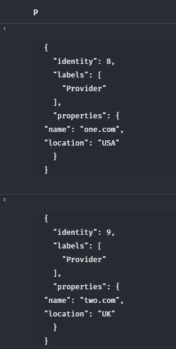&nbsp;&nbsp;&nbsp;&nbsp;&nbsp;&nbsp;&nbsp;   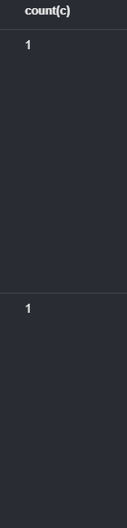 

* The count of courses published by the provider in 2015 is returned.


### SUM:


```
match (p:Provider)-[:PUBLISHED {year: 2015}]->(c:Course)
return p,sum(c.price);
```


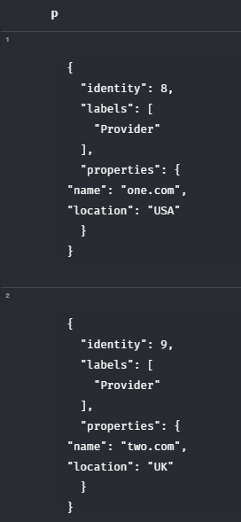&nbsp;&nbsp;&nbsp;&nbsp;&nbsp;&nbsp;&nbsp;   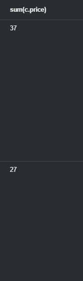 

* The total amount for courses published by each provider in 2015 is obtained.


### MAX:


```
match (p:Provider)-[:PUBLISHED {year: 2015}]->(c:Course)
return p,max(c.price);
```


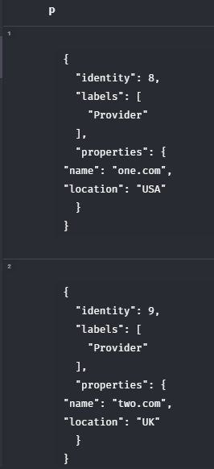&nbsp;&nbsp;&nbsp;&nbsp;&nbsp;&nbsp;&nbsp;   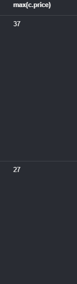 

* The maximum amount of a course by a provider published in 2015 is obtained.


### WITH:


```
match (p:Provider)-[:PUBLISHED {year: 2015}]->(c:Course)
with avg(c.price) as cost ,p
where p.location='UK'
return p,cost;
```


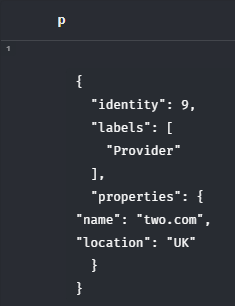&nbsp;&nbsp;&nbsp;&nbsp;&nbsp;&nbsp;&nbsp;   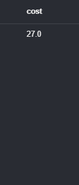 

* The average cost of the course published by a provider based on UK is obtained.


### EXTRACT:


```
RETURN EXTRACT(a IN [1,2,3,4,5] | a*2) AS doubleup;
```
*(note: not supported in version - 4.2)*

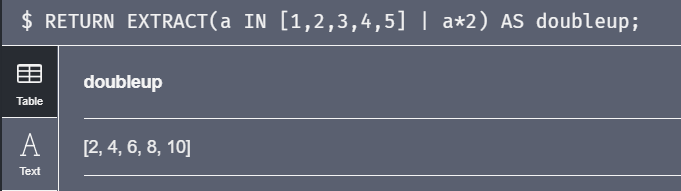 

* The  output of the elements in array known as collection in neo4j is doubled.


```
RETURN [a IN [1,2,3,4,5] | a*2] AS doubleup;
```

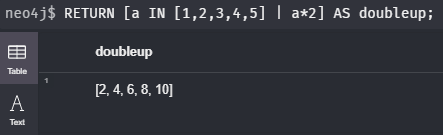 

* The  output of the elements in array known as collection in neo4j is doubled.


### FILTER:


```
RETURN FILTER (i IN [22,34,21,35,36] WHERE i%2=0) AS even;
```
*(note: not supported in version - 4.2)*

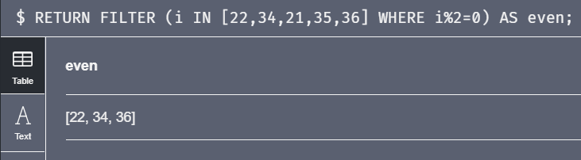 

* Only the even numbers in an array is filtered and obtained.


```
RETURN [i IN [22,34,21,35,36] WHERE i%2=0] AS even;
```

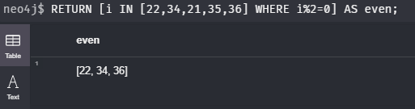 

* Only the even numbers in an array is filtered and obtained.


### IN:


```
MATCH (p:Provider)-[pb:PUBLISHED]
->(c:Course)
WHERE pb.year IN [2012,2014,2015]
RETURN c.title,pb.year;
```


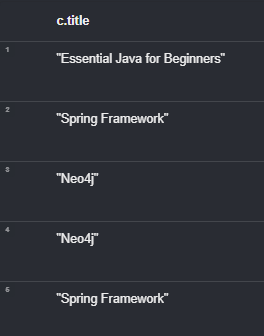&nbsp;&nbsp;&nbsp;&nbsp;&nbsp;&nbsp;&nbsp;   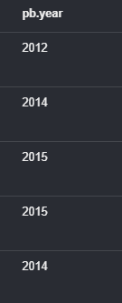 

* The title of courses published in the years 2012,2014,and 2015 is obtained.


### CASE WHEN THEN ELSE END:


```
MATCH (p:Provider)-[pb:PUBLISHED]->(c:Course)
RETURN 
CASE WHEN pb.year=2015 THEN "CurrentYear"
ELSE "Previousyear"
END AS category,c.title
limit 5;
```


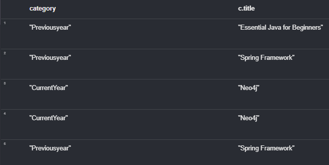 

* The courses are categorized based on the year published using case command.


### ORDER BY & LIMIT:


```
MATCH (c:Course)
RETURN c.code,c.title
order by c.code 
limit 5;
```


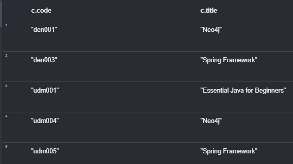 

* The five course titles are obtained in ascending order of the codes.


### ALL:


```
MATCH (p:Provider)-[pb:PUBLISHED]
->(c:Course)
WHERE ALL (tag IN c.tags WHERE tag IN ["java","programming language"])
RETURN c;
```


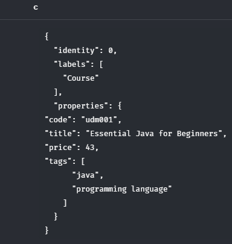 

* The course having tags similar to all the elements in the collection is obtained.


### ANY:


```
MATCH (p:Provider)-[pb:PUBLISHED]
->(c:Course)
WHERE any (tag IN c.tags WHERE tag IN ["java","programming language"])
RETURN c;
```


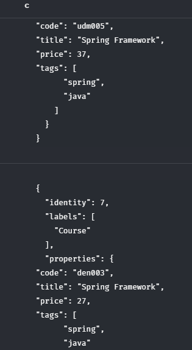 

* The course having tags similar to any one element in the collection is obtained.


### ENTIRE GRAPH:


```
MATCH(n) RETURN(n);
```


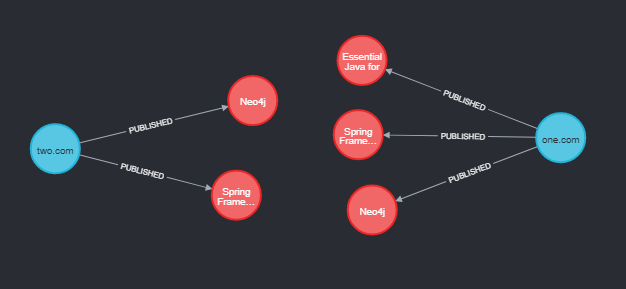 

* The entire nodes and their corresponding relationship is obtained.
